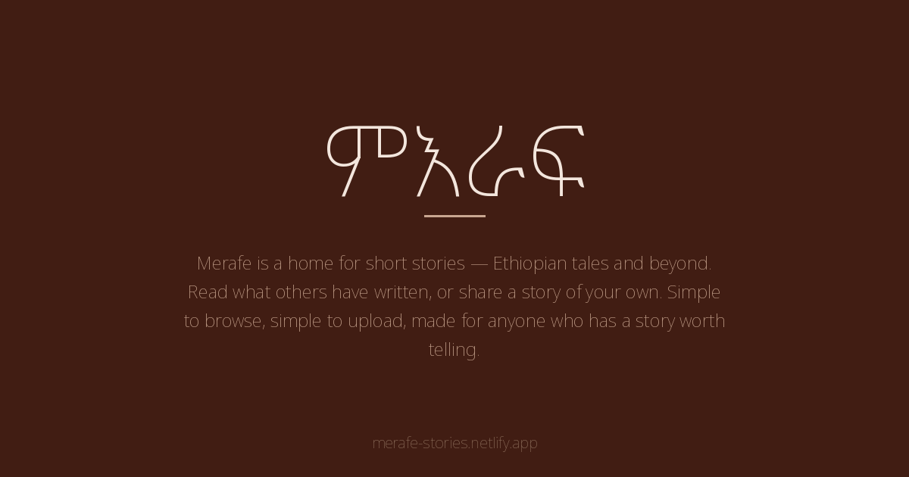
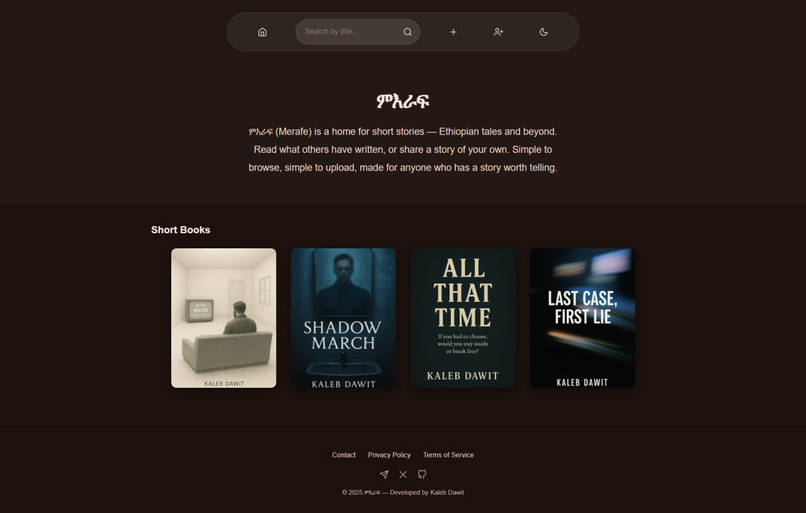
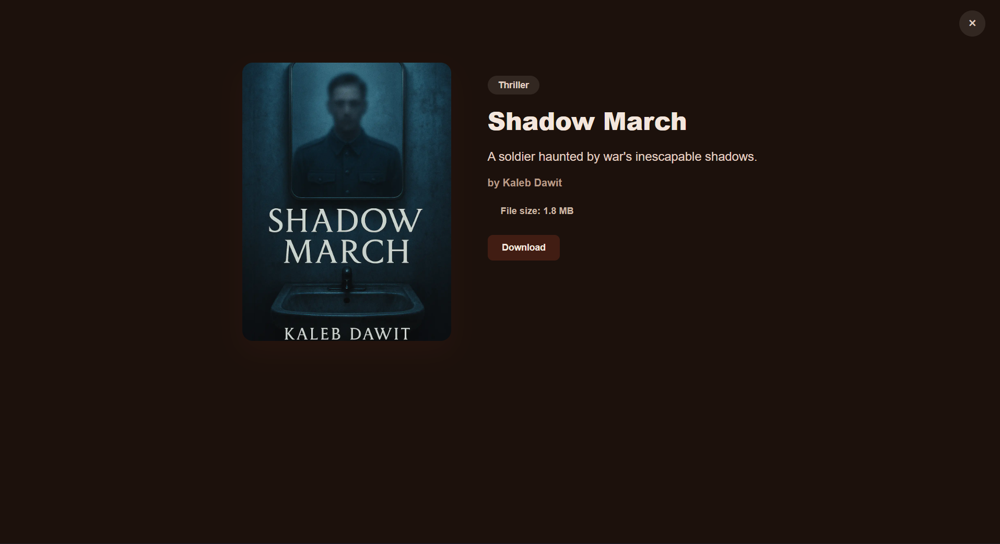
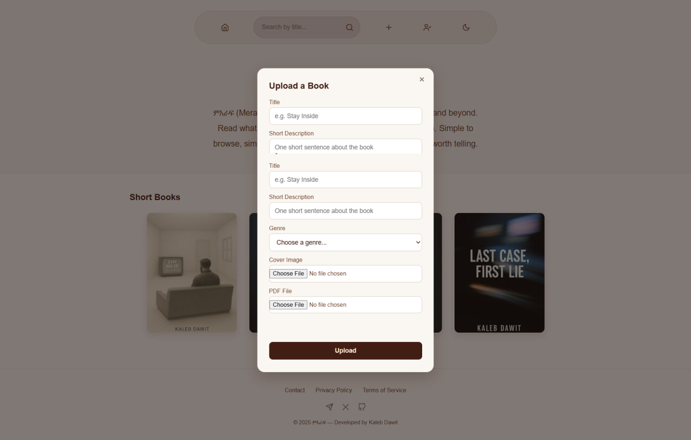

# ምእራፍ (Merafe)

**A home for short stories — Ethiopian tales and beyond.**

Merafe is a simple, community-driven platform where writers can upload short stories and readers can browse, search, and download them. Built as a solo full-stack project, from concept to deployment.

🔗 **Live site:** [merafe-stories.netlify.app](https://merafe-stories.netlify.app/)



---

## ✨ Features

- 📚 Browse and search short stories by title
- ⬆️ Upload your own stories (PDF + cover image) with genre tagging
- ✅ Admin approval flow — every upload is reviewed before going public
- 🔐 Firebase Authentication (sign up, log in, email verification, password reset)
- 🌗 Light / dark theme, synced across the whole site
- 📱 Fully responsive, mobile-first design
- 🛡️ Duplicate detection (title, cover, and file-hash based)
- ⚡ Client-side image compression before upload for faster, lighter uploads

## 🛠️ Tech Stack


- **Frontend:** Vanilla HTML, CSS, JavaScript (no framework)
- **Auth & Database:** Firebase Authentication + Firestore
- **File storage:** Cloudinary (cover images + PDFs)
- **Hosting:** Netlify

## 🚀 Getting Started

Clone the repo and open it locally:

```bash
git clone https://github.com/kaleb2343/merafe-stories.git
cd merafe-stories
```

Since this project uses Firebase, you'll need to create your own `firebase-config.js` with your own Firebase project credentials to run it locally with full functionality (auth, uploads, database).

Open `index.html` in a live server (e.g. VS Code's Live Server extension) — that's it, no build step required.

## 📸 Screenshots

|  |  |  |

## 🗺️ Roadmap

- [ ] User profile pages with public author bios
- [ ] Comments / reactions on stories
- [ ] Pagination for larger libraries

## 📄 License

This project is open source and available under the [MIT License](LICENSE).

## 👤 Author

**Kaleb Dawit**
- GitHub: [@kaleb2343](https://github.com/kaleb2343)
- Site: [kalebdawit.vercel.app](https://kalebdawit.vercel.app)